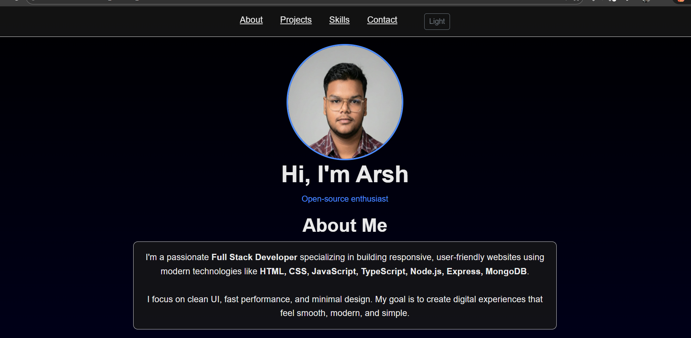

# Personal Portfolio Website

🌐 **Modern Portfolio Website — HTML, Bootstrap, CSS, JS & TypeScript**

A clean, responsive, and modern personal portfolio website built using HTML5, Bootstrap 5, CSS3, JavaScript, and TypeScript. This project is designed to showcase personal skills, projects, contact details, and achievements in a professional way.
(Portfolio/images/SC-1.png)
---

## 🚀 Features

- ✅ Fully responsive layout (mobile, tablet, desktop)
- ✅ Modern Bootstrap 5-based UI
- ✅ Smooth animations using JavaScript
- ✅ Clean and structured CSS styling
- ✅ Interactive components:
  - Dynamic project cards
  - Animated skill bars
  - Contact form UI
- ✅ TypeScript for type-safe interactions
- ✅ SEO-friendly code
- ✅ Easy to customize

---

## 📁 Project Structure

```
Personal_Portfolio_Website/
├── Portfolio/
│   ├── index.html          # Main HTML file
│   ├── style.css           # Custom CSS styles
│   └── dist/               # Compiled JavaScript output
│       ├── main.js         # Compiled TypeScript
│       ├── main.js.map     # Source map
│       ├── main.d.ts       # Type definitions
│       └── main.d.ts.map   # Type definitions map
├── TS/
│   └── main.ts             # TypeScript source code
├── tsconfig.json           # TypeScript configuration
├── package.json            # Project dependencies & scripts
└── README.md               # This file
```

---

## 📸 Screenshots

### 1. Hero Section - Profile & Bio and Introduction

*Displays profile image, name, and animated typewriter subtitle*

### 2. Projects Grid - Portfolio Showcase

*Dynamic project cards with 6 featured projects*

### 3. Skills Section - Technical Competencies

*Styled skill names with visual progress bars*

### 4. Contact Form - Get in Touch

*Contact form with validation and success alerts*

---

## 🔧 Setup & Installation

### Prerequisites
- Node.js (v14 or higher)
- npm or yarn
- TypeScript (`npm install -g typescript`)

### Installation Steps

1. **Navigate to the project directory:**
   ```powershell
   cd "D:\my project\Personal Portfolio Website\Personal_Portfolio_Website"
   ```

2. **Install dependencies (optional):**
   ```powershell
   npm install
   ```

3. **Compile TypeScript:**
   ```powershell
   npm run build
   # or directly: tsc
   ```

4. **Open in browser:**
   - Open `Portfolio/index.html` in your web browser

---

## 📝 Available Scripts

Run these commands from the project root:

| Command | Description |
|---------|-------------|
| `npm run build` | Compile TypeScript to JavaScript |
| `npm run watch` | Watch mode - auto-compile on file changes |
| `npm run start` | Build and show completion message |
| `npm run clean` | Remove compiled files |

---

## 🎯 How Files Connect

### HTML to CSS & JavaScript
- **index.html** links to:
  - `style.css` for styling
  - `dist/main.js` for compiled TypeScript functionality
  - Bootstrap 5 CDN for UI framework

### TypeScript Compilation Flow
```
TS/main.ts → TypeScript Compiler (tsc) → Portfolio/dist/main.js
```

The `tsconfig.json` configures:
- **Input**: All `.ts` files in the `TS/` folder
- **Output**: Compiled `.js` files in `Portfolio/dist/`
- **Options**: Strict type checking, ES2020 target, source maps

### JavaScript Execution
When `Portfolio/index.html` loads, it:
1. Loads Bootstrap CSS & JS from CDN
2. Loads custom `style.css`
3. Loads compiled `dist/main.js` which:
   - Sets current year in footer
   - Implements theme toggle (dark/light mode)
   - Creates typewriter animation
   - Dynamically injects project cards
   - Handles contact form submission

---

## ✨ Customization Guide

### Add More Projects
Edit `TS/main.ts` and modify the `projects` array:
```typescript
const projects = [
  {title:'Your Project', desc:'Your Description', url:'#'},
  {title:'Another Project', desc:'Its Description', url:'#'}
];
```

### Update Skills
Modify the skills section in `Portfolio/index.html`:
```html
<div class="col-md-4">Your Skill <div class="progress"><div class="progress-bar" style="width:95%"></div></div></div>
```

### Change Theme Colors
Edit `Portfolio/style.css`:
```css
.section-hero {
  background: linear-gradient(135deg, #your-color-1, #your-color-2);
}
```

---

## 🌙 Dark Mode

The portfolio includes a built-in dark/light theme toggle:
- Click the "Dark" button in the navbar to switch themes
- Theme preference is stored in DOM attributes
- Custom CSS handles styling for both themes

---

## 📦 Dependencies

- **Bootstrap 5.3.2** - UI Framework (CDN)
- **TypeScript 5.3** - Type-safe JavaScript (Dev dependency)
- **Inter/System UI Fonts** - Modern typography

---

## 🚀 Deployment

To deploy this portfolio:

1. Ensure TypeScript is compiled: `npm run build`
2. Upload the entire `Personal_Portfolio_Website/Portfolio/` folder to your hosting
3. Your hosting provider should serve `index.html` as the entry point

**Popular Hosting Options:**
- GitHub Pages
- Netlify
- Vercel
- Firebase Hosting

---

## 📄 License

MIT License - Feel free to use this project as a template for your own portfolio!

---

## 👤 Author

**Arsh Kureshi**
- Portfolio: [Your Site]
- GitHub: [@arsh-ke](https://github.com/arsh-ke)

---

## 💡 Tips

- Always run `npm run build` after modifying TypeScript files
- Use `npm run watch` during development for automatic recompilation
- Check browser console (F12) for any JavaScript errors
- Test responsiveness using browser DevTools

---

**Happy coding! 🎉**
